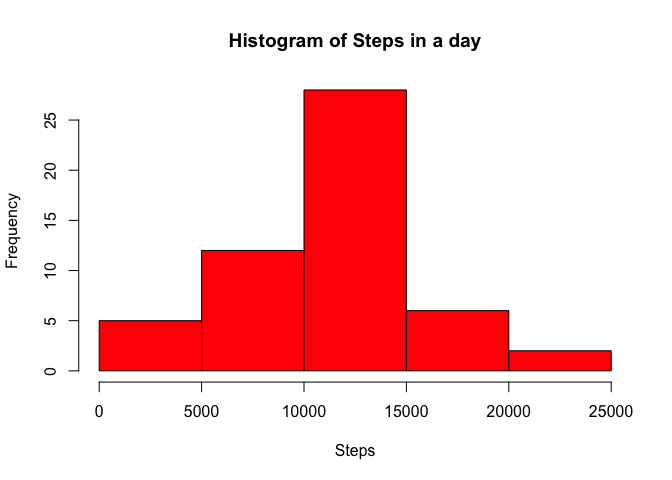
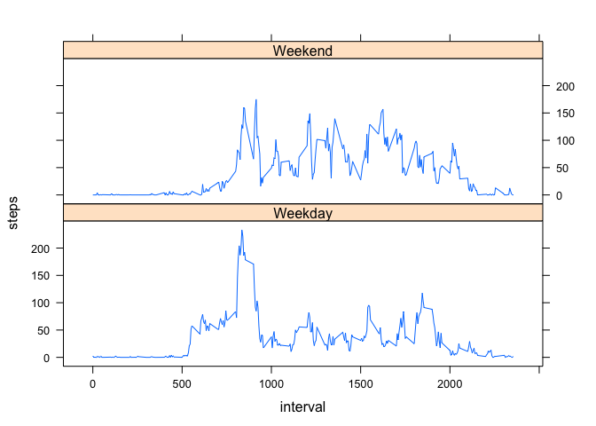

# Reproducible Research: Peer Assessment 1


## Loading and preprocessing the data

The data is read from the activity.csv data file and the date is reformatted into the date class.

```r
dt <- read.csv("activity.csv", header = TRUE, stringsAsFactors = FALSE)
dt$date <- as.Date(dt$date, "%Y-%m-%d")
head(dt)
```

```
##   steps       date interval
## 1    NA 2012-10-01        0
## 2    NA 2012-10-01        5
## 3    NA 2012-10-01       10
## 4    NA 2012-10-01       15
## 5    NA 2012-10-01       20
## 6    NA 2012-10-01       25
```

## What is mean total number of steps taken per day?

The steps are summed over all the intevals, grouped by the date.

```r
a <- aggregate(steps ~ date, dt, sum)
hist(a$steps, xlab = "Steps", main = "Histogram of Steps in a day", col = "Red")
```

 

The average steps taken per day is 

```r
mean(a$steps)
```

```
## [1] 10766.19
```

and the median is 

```r
median(a$steps)
```

```
## [1] 10765
```

## What is the average daily activity pattern?

Here were are averaging the number of steps across all days within each interval.

```r
a <- aggregate(steps ~ interval, dt, mean)
plot(a$interval, a$steps, type = 'l', xlab = "Interval", ylab = "Mean steps")
```

 

The interval with maximum average number of steps across days is as follows.

```r
a$interval[a$steps == max(a$steps)]
```

```
## [1] 835
```

## Inputing missing values

The total number of missing steps data is calculated to be:

```r
sum(is.na(dt$steps))
```

```
## [1] 2304
```

To estimate the missing values, we find the mean steps across days for each interval and use that value to fill in the missing data.


```r
dt[is.na(dt$steps),]$steps <- a$steps[dt[is.na(dt$steps),]$interval == a$interval]
a <- aggregate(steps ~ date, dt, sum)
hist(a$steps, xlab = "Steps", main = "Histogram of Steps in a day", col = "Red")
```

 

Evaluating mean and median again:

The average steps taken per day is 

```r
mean(a$steps)
```

```
## [1] 10766.19
```

and the median is 


```r
median(a$steps)
```

```
## [1] 10765.59
```

The filling in of data has not affected the mean and medium significantly.

## Are there differences in activity patterns between weekdays and weekends?

```r
wknd  <- weekdays(dt$date)=="Saturday"|weekdays(dt$date)=="Sunday"
dt$dow[wknd] <- "Weekend"
dt$dow[!wknd] <- "Weekday"
dt$dow <- as.factor(dt$dow)
a <- aggregate(steps ~ interval + dow, dt, mean)
library(lattice)
xyplot(steps~interval | dow, data = a, layout = c(1,2), type = 'l')
```

 

Based on the plots above we see that during weekends the activity is more distributed during the day while in the weekdays it is concentrated towards the beginning of the day around the 1000th interval.
